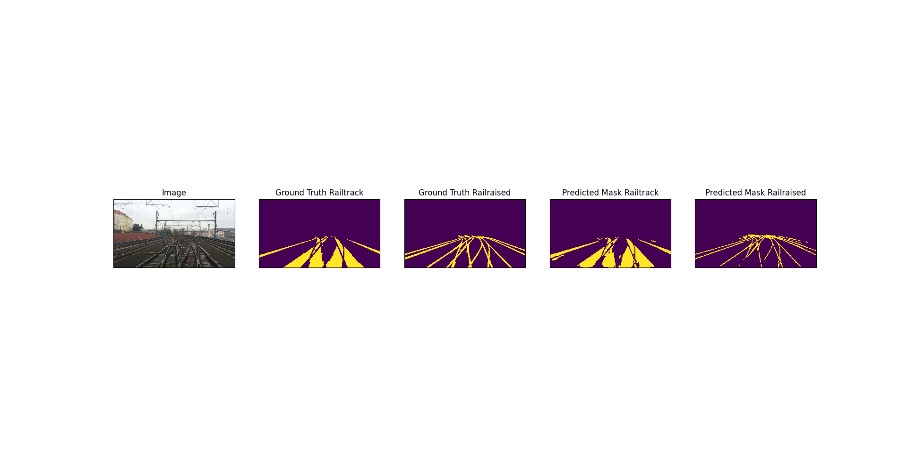

# DeepLabV3Plus + RailSem19

DeepLabV3Plus : 

See in paper : Encoder-Decoder with Atrous Separable Convolution for Semantic Image Segmentation

From : https://arxiv.org/abs/1802.02611 

This segmentation model is packed in Package: segmentation_models_pytorch which included several different segmentation models.

See in : http://github.com/qubvel/segmentation_models.pytorch

This Dataset is A Dataset for Semantic Rail Scene Understanding from AIT Austrian Institute of Technology GmbH included 19 classes marked

# Preprocess
This file is for preprocessing the dataset so that it can be correctly loaded and run in model.

## main_dataset

1) Read
2) Reshape:

        masks = [(mask == v) for v in self.class_values]
        mask = np.stack(masks,axis = -1).astype('float')
    Put divided masks into one entire mask(for selecting needed mask for training) 

3) augumentation
    
    
    code-> train.py

    augumentation is for resize, crop or transform, in this progress, training size is designed as 720 * 720 while in evaluating part the test size is designed as 1920*1920

    ### Noticed: the image has to crop into square or Error may happened 

        RuntimeError: invalid argument 0: Sizes of tensors must match except in dimension 1. Got 270 and 272 in dimension 2 at /pytorch/aten/src/THC/generic/THCTensorMath.cu:71

4) preprocessing

    code-> train.py

    reshape the type from numpy into Tensor 
    
    ### Noticed: if loss criterion is BCE or Dice loss, there is no need to change type to .long() for mask while it is needed when the loss criterion is crossntropy

## vis_dataset

This function is designed for visualize the dataset which is used only in plot part for it only read the image without other operations

1) Visualize 

    this fuction is used for visualize the image and mask in evaluate.py the input type should be an image type. So it is necessary to do some transform. See in evaluate.py

## Train
This file is traning part included the dataset preparation, model definition, training and save.

While using the package segmentation_models_pytorch, we are only required to define 

1. Dataset : RailSem 19

2. Encoder : Resnet 101 (Backbone)

3. ACTIVATION :'sigmoid'

4. Classes : rail-track , rail-raised (only for this task)

5. Loss : DiceLoss

6. Metrics :Accuracy

7. Optimizer : Adam

8. lr_scheduler(optional) : CosineAnnealing
 
 by API packed from it.

1)  Model definition

        CLASSES = ['rail-track','rail-raised']
    
        ENCODER = 'resnet101'
        ENCODER_WEIGHTS = 'imagenet'
        ACTIVATION = 'sigmoid'

        model = smp.DeepLabV3Plus(
            encoder_name = ENCODER,
            encoder_weights = ENCODER_WEIGHTS,
            activation =ACTIVATION,
            classes =len(CLASSES),
        )

2)  Preparation for dataset

        preprocessing_fn = smp.encoders.get_preprocessing_fn(ENCODER,ENCODER_WEIGHTS)

        images_dir = os.path.join(args.data_dir,'jpgs')
        masks_dir = os.path.join(args.data_dir,'uint8')
        jsons_dir = os.path.join(args.data_dir,'jsons')

        org_dataset = main_dataset(
            images_dir, 
            masks_dir, 
            args.image_count,
            augmentation = get_training_augmentation(),
            preprocessing = get_preprocessing(preprocessing_fn),
            classes = CLASSES
        )

        validation_split = args.val_split
        train_dataset, val_dataset = random_split(org_dataset, [int(args.image_count*(1-args.val_split)),int(args.image_count*args.val_split)] )

        train_loader = DataLoader(train_dataset, batch_size=16, shuffle=True)#, num_workers=12)
        val_loader = DataLoader(val_dataset, batch_size=16, shuffle=True)#, num_workers=4)

3) Training progress definition

        TRAIN = True

        #loss = smp.utils.losses.CrossEntropyLoss(ignore_index=255)
        loss = smp.utils.losses.DiceLoss()
        metrics = [
            #smp.utils.metrics.IoU(threshold=0.5),
            smp.utils.metrics.Accuracy(threshold=0.5),
        ]

        #optimizer = torch.optim.SGD(params=model.parameters(), lr=0.001, momentum=0.9)
        optimizer = torch.optim.Adam([
            {'params' : model.decoder.parameters(), 'lr': 0.001},
        ])

        train_epoch = smp.utils.train.TrainEpoch(
            model, 
            loss=loss, 
            metrics=metrics, 
            optimizer=optimizer,
            device=DEVICE,
            verbose=True,
        )

        val_epoch = smp.utils.train.ValidEpoch(
            model, 
            loss=loss, 
            metrics=metrics, 
            device=DEVICE,
            verbose=True,
        )

4) Training progress

        train_logs = train_epoch.run(train_loader)

# Evaluate
In this file, we use the same way as in train.py to do same preprocessing for dataset. Then it will load model pretrained the visualize the predictions.

1) Model definition
2) Preprocessing for test dataset
3) Model loading and apply

        best_model = torch.load('/home/data1/Pdy_ws/squeezenas_train-master/railsem_trained_weights_new_temp/DeepLabV3Plus.pth')
    
        test_epoch = smp.utils.train.ValidEpoch(
            model = best_model, 
            loss=loss, 
            metrics=metrics, 
            device=DEVICE,
            verbose=True,
        )
        logs = test_epoch.run(test_loader)

4) Visualize

        visual_dataset = vis_dataset(
        images_dir, 
        masks_dir, 
        classes = CLASSES
        )

        for i in range(1):
            n = np.random.choice(len(test_dataset))
            
            image ,mask= visual_dataset[n]
    
            img , gt_mask= test_dataset[n]

            gt_mask_railtrack=mask[:,:,0].squeeze()
            gt_mask_railraised=mask[:,:,1].squeeze()

            x_tensor = torch.from_numpy(img).to(DEVICE).unsqueeze(0)
            pr_mask = best_model.predict(x_tensor)

            pr_mask_railtrack = pr_mask.cpu().squeeze()[0,:,:].numpy().round()
            pr_mask_railraised = pr_mask.cpu().squeeze()[1,:,:].numpy().round()
            
            visualize(image = image,
            ground_truth_railtrack = gt_mask_railtrack,
            ground_truth_railraised = gt_mask_railraised,
            predicted_mask_railtrack = pr_mask_railtrack,
            predicted_mask_railraised = pr_mask_railraised,
            )

### Noticed: Due to the image and mask is processed in vis_dataset in preprocess.py. The type is transformed into np.float32. As a result there will exist one dimension extra so that it is required to use squeeze() to cut the dimension.

### Noticed: The prediction inputs' and outputs' types are as same as the type preprocessed for training, which means it is required to change numpy type to tensor for input while change tensor to numpy for visualizing.

# Results

### Noticed: if the segmentation target is seriously covered by others the performanced will be bad.

## Noticed: the best performed model is saved as DeepLabV3Plus_7_12_9.pth for I think it has not over-fitted so badly yet. 
(Named Rules: 7_12_9 means saved at 9 a.m in 12th July )

# Others thoughts

## Latency
Due to the huge structure of DeepLabV3Plus, it is obviouly really difficult to use it in CCTV scanning project or the latency would cause several strict problems.

So as to say, if we are required to perform a segmentation model in actual time, it is suggested to use other tiny net model although the accuracy may perform worse.

Suggested Model: 

1.  SqueezeNas(ICCV 2019) http://arxiv.org/abs/1908.01728
2.  STDC(CVPR 2021) http://arxiv.org/abs/2104.13188

## Accuracy

Obviously, the model performed well and the accuracy is not bad. In other words, it is not easy to find another model to performed much better than DeepLabV3Plus.

As a result, when trying to get a better accuracy on bounding, maybe it is better to use some post-process model to develop the performance.

Suggested Model:
1.  BPR(CVPR 2021) http://arxiv.org/abs/2104.05239

